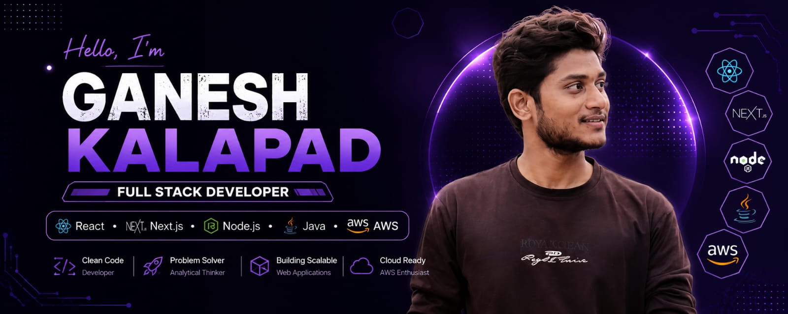

<p align="center">
  
</p>


<p align="center">
  </br>
  </br>
  <a href="https://git.io/typing-svg">
    
  </a>
</p>

<div align="center">

[](https://github.com/gk155586)&nbsp;
[](https://www.linkedin.com/in/ganesh-kalapad-4100a4259)&nbsp;
[](https://gk155586.github.io/Ganeshas_Portfolio/)&nbsp;
[](mailto:ganeshkalapadgk@gmail.com)

&nbsp;
&nbsp;


</div>


## 👨‍💻 About Me


```yaml
name: Ganesh Sadashiv Kalapad
location: Pune, Maharashtra, India
role: Full Stack Developer & Backend Engineer
education: B.Tech CSE — MGM's College of Engineering

currently:
  - Building production-grade web platforms
  - Mastering AWS, System Design & AI integrations
  - Published researcher in IJIRT (NLP & Sentiment Analysis)
  - Open to collaborate on impactful open-source projects

superpower: Turning ideas into deployed, scalable systems

highlights:
  - Architected a 3-app monorepo serving production traffic
  - Reduced API latency by 25% through query optimization
  - Built real-time systems processing live order tracking
  - Published a peer-reviewed research paper at 22
```

<br clear="both"/>


## 📊 Impact at a Glance

<div align="center">

| 🚀 Production Apps | 🔌 REST APIs | ⚡ Latency Reduced | 📈 Faster APIs |
|:---:|:---:|:---:|:---:|
| **3** | **50+** | **40%** | **25%** |
| Customer · Admin · Delivery | Express.js + Prisma ORM | Real-time via Socket.io | Query Optimization |

</div>


## 🛠️ Tech Arsenal

### Languages
<p>
  <a href="https://www.java.com"></a>&nbsp;
  <a href="https://developer.mozilla.org/en-US/docs/Web/JavaScript"></a>&nbsp;
  <a href="https://www.typescriptlang.org"></a>&nbsp;
  <a href="https://www.python.org"></a>&nbsp;
  <a href="https://en.cppreference.com/w/c"></a>
</p>

### Frontend & UI
<p>
  <a href="https://react.dev"></a>&nbsp;
  <a href="https://nextjs.org"></a>&nbsp;
  <a href="https://tailwindcss.com"></a>&nbsp;
  <a href="https://vitejs.dev"></a>&nbsp;
  <a href="https://developer.mozilla.org/en-US/docs/Web/HTML"></a>&nbsp;
  <a href="https://developer.mozilla.org/en-US/docs/Web/CSS"></a>
</p>

### Backend & Runtime
<p>
  <a href="https://nodejs.org"></a>&nbsp;
  <a href="https://expressjs.com"></a>&nbsp;
  <a href="https://www.prisma.io"></a>
</p>

### Databases
<p>
  <a href="https://www.postgresql.org"></a>&nbsp;
  <a href="https://www.mongodb.com"></a>&nbsp;
  <a href="https://www.mysql.com"></a>&nbsp;
  <a href="https://redis.io"></a>
</p>

### Cloud & DevOps
<p>
  <a href="https://aws.amazon.com"></a>&nbsp;
  <a href="https://www.docker.com"></a>&nbsp;
  <a href="https://git-scm.com"></a>&nbsp;
  <a href="https://github.com"></a>&nbsp;
  <a href="https://vercel.com"></a>&nbsp;
  <a href="https://nginx.org"></a>
</p>

### Tools & Platforms
<p>
  <a href="https://code.visualstudio.com"></a>&nbsp;
  <a href="https://www.postman.com"></a>&nbsp;
  <a href="https://www.figma.com"></a>&nbsp;
  <a href="https://www.linux.org"></a>&nbsp;
  <a href="https://www.notion.so"></a>
</p>


## 💼 Professional Experience

### 🏢 Software Engineer Intern — YugaYatra Retail (OPC) Pvt. Ltd.

**`Feb 2026 – May 2026`** · Contributed to **FreshIn10** Quick-Commerce Platform

```
📦 Architecture   ➜ Monorepo (Turborepo) powering 3 Next.js production apps
🔌 Backend        ➜ 50+ RESTful APIs with Express.js, Prisma ORM, PostgreSQL
📡 Real-time      ➜ Socket.io for live order tracking (40% latency reduction)
🔐 Security       ➜ JWT authentication with refresh tokens & RBAC
💳 Payments       ➜ Razorpay integration with webhook verification
🗃️ Caching        ➜ Redis for session management & data layer caching
🐳 Infrastructure ➜ Dockerized deployment on AWS (EC2, RDS, S3)
⚡ Performance    ➜ 25% faster API responses via query optimization
```

### 🏢 Java Developer Intern

**`1 Month`** · Enterprise Web Application Development

```
☕ Backend     ➜ Java-based backend services & API development
🎨 Frontend    ➜ UI design & frontend-backend integration
🔗 Integration ➜ Seamless data flow across distributed components
```


## 🚀 Featured Projects

### 🛒 [FreshIn10 — Quick Commerce Platform](https://fresh-in10-vqrdg4ff8-gk155586s-projects.vercel.app/)

> **10-minute grocery delivery** with real-time tracking, multi-role apps & payments


`🏗️ Turborepo monorepo` · `📡 Live order tracking` · `🔐 JWT + RBAC` · `💳 Razorpay payments` · `🐳 Dockerized`

---

### 🤖 [AI E-Commerce Personalization Engine](https://ai-ecommerce-personalization-rules.vercel.app/)

> **Rule-based recommendation engine** personalizing shopping with behavioral data


`🧠 Behavior analysis` · `🎯 Smart recommendations` · `📊 Customer insights`

---

### 📰 Real-Time News Sentiment Analyzer + Summarizer &nbsp; [](https://www.ijirt.org/)

> **NLP pipeline** for real-time sentiment analysis across 10+ news sources


`📡 10+ sources scraped` · `🔍 NLP classification` · `📊 Interactive dashboard` · `📝 Peer-reviewed`

---

### 💬 FeedbackHub — Enterprise Feedback Platform

> **Secure feedback management** with role-based admin dashboard & analytics


`🔐 Secure auth` · `👥 User management` · `📈 Analytics dashboard` · `📤 Data export`

---

### 📚 Library Management System

> **Full OOP Java application** with automated fine calculation & role management


`☕ Core OOP design` · `📖 Book cataloging` · `⏱️ Auto fine calculation` · `🗄️ MySQL persistence`


## 📝 Publication

<div align="center">

[](https://www.ijirt.org/)

**"Real-Time News & Social Media Sentiment Analyzer + Summarizer"**
<br/>*International Journal of Innovative Research in Technology (IJIRT)*
<br/>Vol. 12, Issue 8, pp. 5305–5309 · 2026
<br/>Co-authored peer-reviewed research on NLP-based sentiment analysis with automated text summarization.

</div>


## 🏅 Certifications

<div align="center">


<br/>


<br/>
-86BC25?style=for-the-badge)
-FF6F00?style=for-the-badge)


</div>


## 📈 GitHub Analytics

<div align="center">

<a href="https://github.com/gk155586">
  
</a>

<br/><br/>

<a href="https://github.com/gk155586">
  
</a>

<br/><br/>

<picture>
  <source media="(prefers-color-scheme: dark)" srcset="https://raw.githubusercontent.com/gk155586/gk155586/output/github-snake-dark.svg" />
  <source media="(prefers-color-scheme: light)" srcset="https://raw.githubusercontent.com/gk155586/gk155586/output/github-snake.svg" />
  
</picture>

</div>


## 🏗️ System Architecture I've Built

```
╔═══════════════════════════════════════════════════════════════════╗
║                    FreshIn10 — Architecture                       ║
╠═══════════════════════════════════════════════════════════════════╣
║                                                                   ║
║   ┌────────────┐   ┌────────────┐   ┌────────────┐                ║
║   │  Customer  │   │   Admin    │   │  Delivery  │  Next.js       ║
║   │    App     │   │    App     │   │    App     │  React         ║
║   └─────┬──────┘   └─────┬──────┘   └─────┬──────┘  Zustand       ║
║         │                │                │                       ║
║         └────────────────┼────────────────┘                       ║
║                          │                                        ║
║                ┌─────────▼─────────┐                              ║
║                │    API Gateway    │  Express.js                  ║
║                │   50+ REST APIs   │  JWT + RBAC                  ║
║                └───┬───────────┬───┘                              ║
║                    │           │                                  ║
║            ┌───────▼───┐ ┌────▼───────┐                           ║
║            │ Socket.io  │ │  Razorpay  │  Real-time               ║
║            │ WebSocket  │ │  Webhooks  │  Payments                ║
║            └───────┬───┘ └────────────┘                           ║
║                    │                                              ║
║            ┌───────▼───────────┐                                  ║
║            │    Prisma ORM     │  Type-safe queries               ║
║            └───┬───────────┬───┘                                  ║
║                │           │                                      ║
║        ┌───────▼───┐ ┌─────▼─────┐                                ║
║        │ PostgreSQL │ │   Redis   │  Persistent + Cache           ║
║        │   (RDS)   │ │  (Cache)  │                                ║
║        └───────────┘ └───────────┘                                ║
║                                                                   ║
║   ┌───────────────────────────────────────────────────────────┐   ║
║   │  AWS (EC2 + RDS + S3) + Docker │ Vercel (Frontend SSR)   │    ║
║   └───────────────────────────────────────────────────────────┘   ║
╚═══════════════════════════════════════════════════════════════════╝
```


## 🎯 2026 Roadmap

```
Q1  ████████████████████████████████████████  ✅  Completed internships & published paper
Q2  ████████████████████████████████░░░░░░░░  🔄  AWS mastery & system design deep-dive
Q3  ██████████████░░░░░░░░░░░░░░░░░░░░░░░░░  ⏳  Open source contributions & AI projects
Q4  ░░░░░░░░░░░░░░░░░░░░░░░░░░░░░░░░░░░░░░  🎯  Join a product-based company
```

- ✅ Build & deploy production-grade systems
- ✅ Publish peer-reviewed research
- 🔄 Master AWS & advanced system design
- ⏳ Contribute to major open-source projects
- ⏳ Build AI-powered production applications
- 🎯 Join a high-impact engineering team


## 🤝 Community & Leadership

<div align="center">

| 🎪 VisioTech 2025 | 🌐 Google Developer Groups | 🎓 DevTown |
|:---:|:---:|:---:|
| **Event Coordinator** | **Active Participant** | **Student Ambassador** |
| Organized tech events & coding competitions for **500+ attendees** at MGM's College | GDG community events & peer tech talks | Mentored students in tech certifications & organized campus drives |

</div>


## 🤝 Let's Build Something Great

<div align="center">

[](mailto:ganeshkalapadgk@gmail.com)&nbsp;&nbsp;
[](https://www.linkedin.com/in/ganesh-kalapad-4100a4259)&nbsp;&nbsp;
[](https://gk155586.github.io/Ganeshas_Portfolio/)&nbsp;&nbsp;
[](https://github.com/gk155586)

<br/>

</div>

<br/>


